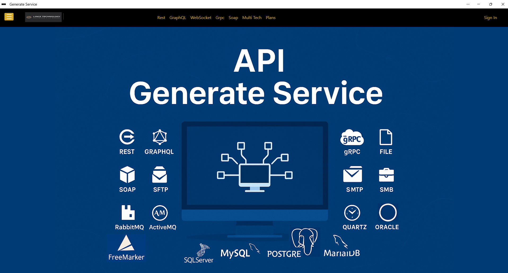
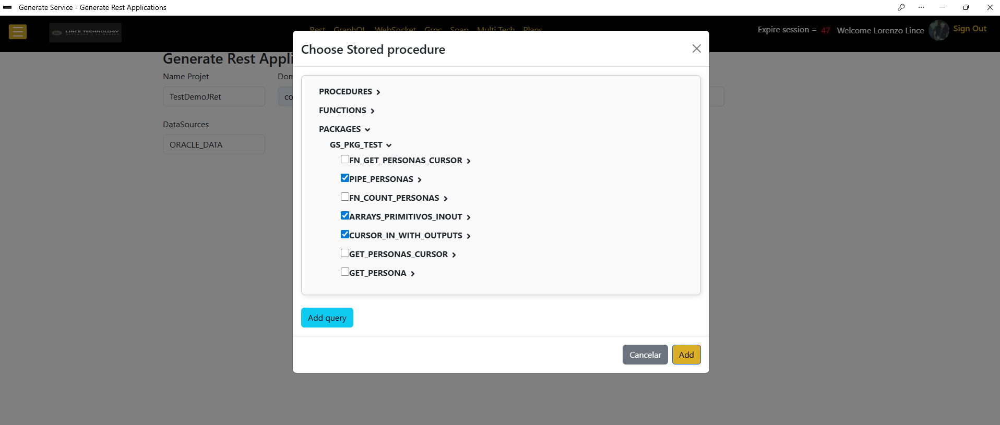
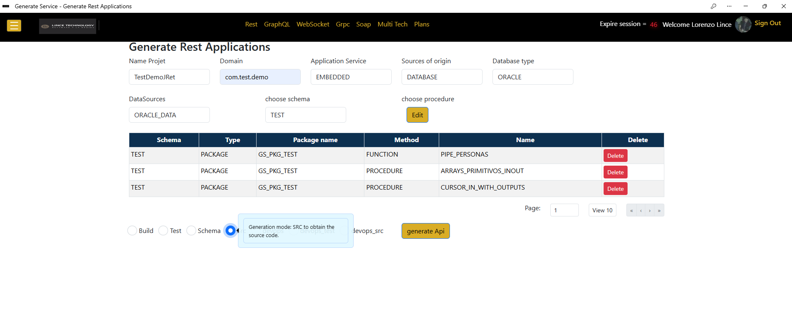
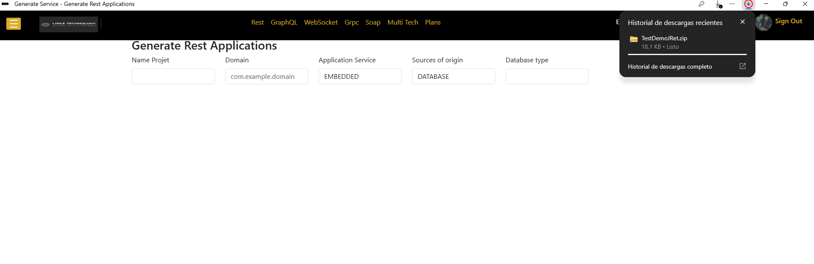
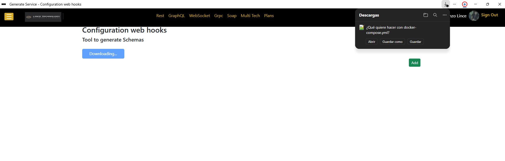
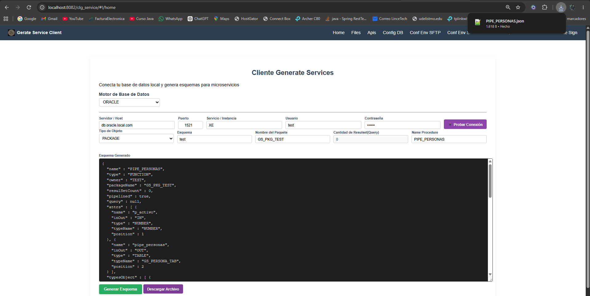
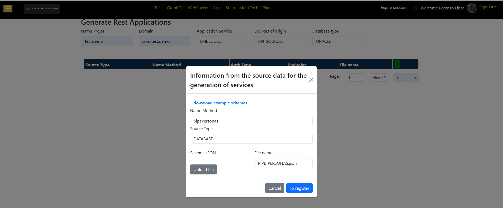
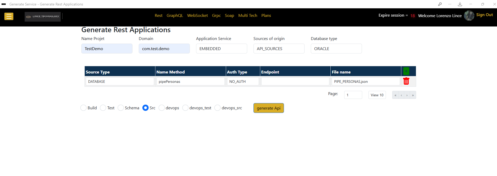
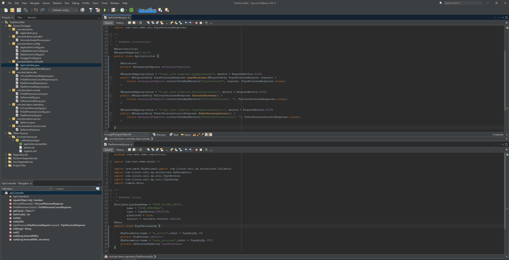
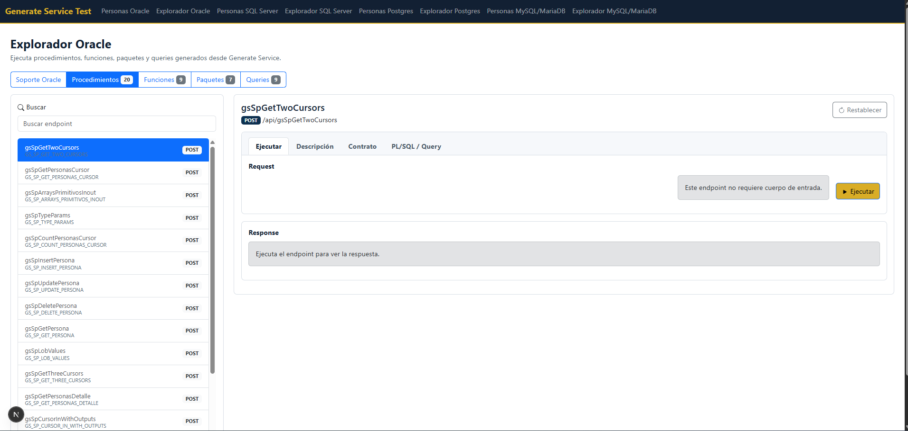

# Generate Service Test

**Generate Service Test** es una guía práctica para probar las capacidades de **Generate Service** a partir de esquemas reales de base de datos. El proyecto reúne motores, scripts SQL, archivos de esquema, una colección de Postman y una interfaz de prueba para que el cliente pueda generar microservicios, consumir sus endpoints y validar el comportamiento resultante.

Generate Service permite crear microservicios de distintos tipos, como REST, GraphQL, gRPC, WebSocket, SOAP y otros modelos de integración, usando como entrada la estructura y la lógica disponible en una base de datos. En este repositorio las pruebas se enfocan en APIs REST, porque el objetivo principal es validar el núcleo del producto: acceso a datos, lectura de metadata, interpretación de parámetros, manejo de tipos complejos y transformación transparente de entradas y salidas.

## Propósito

El propósito de este proyecto es que un cliente pueda probar Generate Service con escenarios preparados y tomar decisiones técnicas con evidencia. Cada motor incluido contiene una base de datos de prueba, scripts de inicialización y archivos de esquema que representan operaciones publicables como servicios.

Con este material, el cliente puede levantar una base de datos, seleccionar los esquemas que quiere probar, generar el microservicio desde Generate Service y ejecutar los endpoints resultantes desde la UI o desde Postman.

También puede extender las pruebas creando sus propios procedimientos, funciones, packages, queries o tipos sobre las bases incluidas, generar nuevos esquemas y validar cómo Generate Service los transforma en servicios consumibles.

## Qué Permite Probar

- Generación de microservicios a partir de procedimientos, funciones, packages y queries.
- Publicación de operaciones de base de datos como endpoints REST.
- Manejo de parámetros de entrada, salida e `INOUT`.
- Transformación de tipos complejos, arreglos, cursores, JSON, objetos y estructuras tabulares.
- Consumo de los endpoints generados desde una interfaz de prueba o desde Postman.
- Comparación de escenarios equivalentes en distintos motores de base de datos.
- Validación de la estructura técnica generada: controllers, services, models, repositories y configuración del microservicio.

## Cómo Se Alimenta Generate Service

Generate Service puede recibir la información del esquema de dos formas principales.

La primera es mediante un datasource configurado en la plataforma. En este flujo, el usuario configura la conexión a la base de datos, Generate Service lee la metadata disponible y presenta los objetos publicables en una vista tipo árbol multiseleccionable. Desde allí el cliente elige qué procedimientos, funciones, packages o queries quiere transformar en endpoints.

La segunda es mediante archivos de esquema. Este repositorio ya incluye archivos `schemas/` por motor, listos para adjuntarse directamente en Generate Service y generar microservicios con las operaciones existentes en las bases de prueba. Si el cliente quiere publicar un procedimiento, función, package, query o tipo que no está incluido aquí, puede usar el cliente local para generar un nuevo archivo de esquema desde su propia base de datos.

El flujo con cliente local está pensado para clientes con políticas de seguridad que prefieren mantener sus conexiones, credenciales y configuraciones dentro de su propio entorno. Para ese caso, Generate Service ofrece un cliente local descargable como `docker-compose.yml`, que se ejecuta cerca de la base de datos, genera archivos de esquema y permite adjuntarlos después en la plataforma. Lo que viaja hacia Generate Service es el archivo de esquema que el cliente decide usar para generar el microservicio.

## Schemas Incluidos

Cada carpeta `schemas/` contiene archivos de esquema correspondientes a operaciones reales definidas en los scripts SQL del motor. Estos archivos tienen la estructura necesaria para que Generate Service pueda crear los microservicios sin que el cliente tenga que volver a generar el esquema desde el cliente local.

- `mysql/schemas/`: schemas para operaciones MySQL.
- `mariaDb/schemas/`: schemas para operaciones MariaDB compatibles con el flujo MySQL/MariaDB.
- `PostgreSQL/schemas/`: schemas para procedimientos, funciones y queries PostgreSQL.
- `OracleDb/schemas/`: schemas para procedimientos, funciones, packages, queries y tipos Oracle.
- `sqlserver/schemas/`: schemas para procedimientos, funciones y queries SQL Server.

Cuando se necesite probar una operación nueva que no exista en estas carpetas, el cliente puede crearla en la base de datos correspondiente y usar el cliente local de Generate Service para generar el nuevo archivo de esquema.

## Contenido del Proyecto

- `mysql/`: scripts, schemas y configuración Docker para MySQL.
- `mariaDb/`: scripts, schemas y configuración Docker para MariaDB compatible con el flujo MySQL/MariaDB.
- `PostgreSQL/`: scripts, schemas y configuración Docker para PostgreSQL.
- `OracleDb/`: scripts, schemas y configuración Docker para Oracle.
- `sqlserver/`: scripts, schemas y configuración Docker para SQL Server.
- `ui_test/`: interfaz de prueba para explorar endpoints, payloads, respuestas y documentación por motor.
- `generate-service-test.postman_collection.json`: colección de Postman para ejecutar escenarios desde un cliente HTTP.

## Flujo de Prueba

1. Levantar el motor de base de datos que se quiere evaluar.
2. Usar los scripts SQL incluidos para inicializar los objetos de prueba.
3. Adjuntar en Generate Service los archivos de `schemas/` incluidos o seleccionar objetos desde un datasource configurado.
4. Generar y descargar el microservicio REST.
5. Ejecutar el microservicio generado en `http://localhost:8083` o ajustar la URL base en la UI y en Postman.
6. Probar los endpoints desde `ui_test/` o desde la colección de Postman.
7. Revisar la documentación de cada operación para entender qué escenario demuestra.

## Puertos y Configuración

La colección de Postman y la interfaz `ui_test/` están configuradas para consumir por defecto microservicios REST en:

```text
http://localhost:8083
```

Por eso, el microservicio generado debe ejecutarse en el puerto `8083` para probarlo sin cambios. Si se ejecuta en otro puerto, se debe actualizar la colección de Postman o configurar la URL base de `ui_test/`, por ejemplo:

```text
API_ENDPOINT_MYSQL=http://localhost:8083
API_ENDPOINT_ORACLE=http://localhost:8083
API_ENDPOINT_POSTGRES=http://localhost:8083
API_ENDPOINT_SQLSERVER=http://localhost:8083
```

La UI de pruebas se ejecuta en el puerto `3033`.

## Ejecutar la UI de Pruebas

La carpeta `ui_test/` contiene la interfaz **Generate Service Test**. Esta UI permite consumir los endpoints generados, revisar payloads, ver respuestas y consultar documentación de soporte por motor, incluyendo tipos de datos soportados y reglas de generación asociadas a nombres de PL/SQL, procedimientos, funciones, queries y atributos.

Requisitos recomendados:

- Node.js `20.x`.
- npm `10.x`.

Comandos de arranque:

```powershell
cd ui_test
npm install
npm run dev
```

La aplicación queda disponible en:

```text
http://localhost:3033
```

## Flujo Visual

### 1. Entrada a Generate Service

La pantalla principal presenta los tipos de servicios e integraciones que puede generar la plataforma, junto con los motores soportados para construir microservicios orientados a datos.



### 2. Selección Desde Datasource

Cuando el cliente trabaja con un datasource configurado, Generate Service muestra los objetos de base de datos disponibles en una vista jerárquica. Desde este árbol se pueden seleccionar procedimientos, funciones y packages para publicarlos como endpoints.



### 3. Endpoints Seleccionados Desde Datasource

Los objetos seleccionados quedan registrados como operaciones que formarán parte del microservicio generado. En este punto el cliente puede revisar nombres, origen, método y configuración antes de iniciar la generación.



### 4. Descarga del Microservicio Generado

Al finalizar la generación, Generate Service entrega el microservicio como un archivo descargable. Ese paquete contiene los componentes necesarios para compilar, ejecutar y probar el servicio generado.



### 5. Descarga del Cliente Local

Generate Service permite descargar el artefacto necesario para ejecutar el cliente local. Este artefacto se entrega como `docker-compose.yml`, facilitando que el cliente levante la herramienta dentro de su propio entorno.



### 6. Generación Local de Esquemas

El cliente local permite conectarse a una base de datos dentro del entorno del cliente, seleccionar el motor y generar el archivo de esquema correspondiente. Las credenciales y la configuración de conexión permanecen localmente.



### 7. Carga de Archivo de Esquema

El archivo de esquema generado localmente puede adjuntarse en Generate Service como fuente para la generación. Cada archivo representa una operación o estructura publicable como endpoint.



### 8. Endpoint Desde Archivo de Esquema

Una vez registrado el archivo, Generate Service lo incorpora como una operación lista para generar dentro del microservicio, manteniendo visible el método, el origen, el nombre del endpoint y el archivo asociado.



### 9. Estructura del Microservicio

El microservicio descargado incluye una estructura técnica lista para desarrollo y validación, con capas como controller, service, model, repository y configuración de aplicación.



### 10. UI de Pruebas Generate Service Test

La interfaz incluida en `ui_test/` permite ejecutar los endpoints generados por motor, inspeccionar payloads y respuestas, y consultar documentación sobre capacidades soportadas, tipos de datos y reglas de generación.



## Para Quién Sirve

Este repositorio está pensado para:

- Clientes que quieren probar Generate Service con bases y esquemas preparados.
- Equipos técnicos que necesitan comprobar capacidades reales antes de adoptar una solución.
- Desarrolladores que quieren entender cómo una operación de base de datos se convierte en un endpoint consumible.
- Arquitectos que deben evaluar alternativas para publicar lógica de datos como microservicios.
- Organizaciones que necesitan probar un flujo donde las conexiones y credenciales puedan mantenerse dentro de su entorno local.

## Resultado Esperado

Al terminar el recorrido, el cliente debe poder levantar una base de datos de prueba, generar un microservicio desde Generate Service, ejecutar sus endpoints y comprobar cómo la plataforma transforma esquemas y operaciones complejas en servicios listos para integrarse en una solución real.
